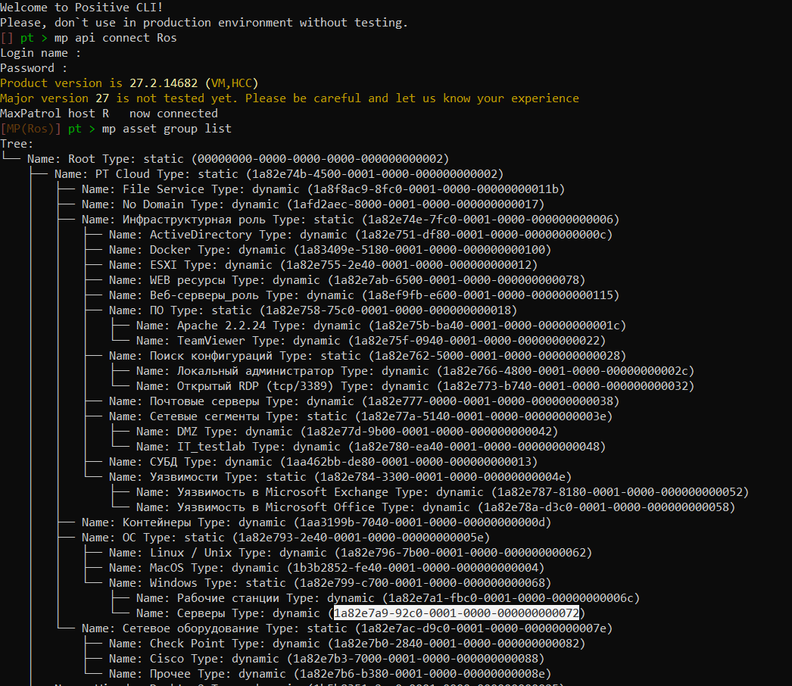

## Экспорт актуальных уязвимостей в CSV или Excel формат

**Настройка:**

1. Заполнить Config файл в папке с основным файлом

```
{
  "core_url": "vmcorehost.fqdn",   -- имя узла с ролью MP Core
  "core_user": "report_user",      -- учётная запись, от которой будет запускаться запрос PDQL - у него должно быть право Raed на работу с активами
  "client_secret": "xxxyyyzz-xxxx-yyyy-zzzz-yyyyzzzzyyyy", -- client secret - его неообходимо забрать с MP Core (описано в документе ниже)
  "PDQL_query": "select(@Host, Host.OsName, Host.Hostname, Host.@CreationTime, Host.@UpdateTime, Host.@AuditTime, Host.@Vulners, Host.@Vulners.Description, Host.@Vulners.CVEs, Host.@Vulners.SeverityRating, Host.@Vulners.Status as Status, Host.@Vulners.IssueTime, Host.@Vulners.Score as Score, Host.@Vulners.HowToFix, Host.@Vulners.VulnerableEntity, Host.@Vulners.DiscoveryTime) | sort(Host.@AuditTime DESC, Host.Hostname DESC) | filter(Score >=7) | filter(Status != 'fixed') | sort(Host.@UpdateTime DESC)", -- сам запрос, такой же как в консоли VM
  "table_headers":["@Host", "Host.@Vulners", "Host.@Vulners.CVEs", "Host.@Vulners.Ids", "Host.@Vulners.Description", "Host.@vulners.Score", "host.@vulners.severityrating", "host.@vulners.DiscoveryTime"], --хэдер - первая строка отчёта. Можно перевести на русский. Должна соответстовать порядку полей в pdql запросе в скобках select
  "selectedGroupIds": ["xxxyyyzz-xxxx-yyyy-zzzz-yyyyzzzzyyyy"], -- список id групп активов, относительно которых будет выполнен запрос. На эти группы должны быть права на чтение. Если список пустой - запрос будет выполнен относительно всех активов. Может быть указана и только 1 группа.
  "output_file":"C:/Dev/vm_vulners-main/result-vulners" --путь, куда выгружать результаты, без расширения. Комп и УЗ от которой идет запус должен иметь доступ и в VM (на чтение) и к конечному пути (на запись). Конечный путь может быть как локальным, так и сетевой папкой
  "output_format": "Excel" -- формат выгрузки. Если Excel не нужен, то можно указать CSV
}
```

Значение параметра Client-secret можно получить на сервере с ролью Core:

Windows:

`corecfg get`


Linux:

`grep ClientSecret /var/lib/deployer/role_instances/core*/params.yaml`

или

`cat $(find /var/lib/deployed-roles/cat $(find /var/lib/deployed-roles/mp10-application -name "default.env") | grep -i ClientSecret -name "default.env") | grep -i ClientSecret`


Знаения  *selectedGroupIds* для групп активов, относительно которых надо собрать данные можно получить например через VM Cli по ссылке:
https://github.com/Reddoks/positive_cli

Пример:

```mp asset group list```



**Запуск:**

Можно запускать скрипт указывая различные файлы с параметрами, например, для разных отчетов с разыми запросами.
По умолчанию скрипт ищет файл параметров 'config.json'

Общий вид команды

main.py --password "Report user password" --config "path to config file"

Пример
```shell
python ./main.py --password "P@ssw0rd" --config "config_my.json"
```

